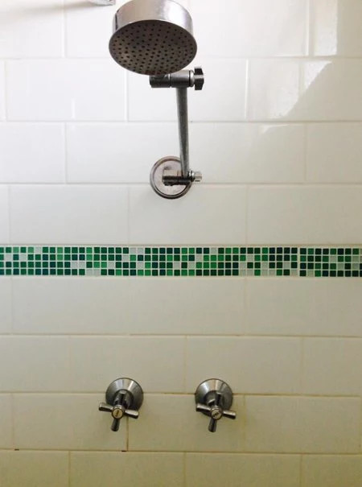

**************
Github scammer
**************

.. image:: https://img.shields.io/badge/python-3.6+-blue
   :target: https://www.python.org/downloads/release/python-350/
   :alt: Python3.5+ compatible

.. image:: https://img.shields.io/badge/License-MIT-green.svg
   :target: https://github.com/thomasperrot/aes-square-attack/blob/master/LICENSE.rst
   :alt: MIT License

.. image:: https://img.shields.io/badge/code%20style-black-000000.svg
   :target: https://github.com/psf/black
   :alt: Code style black

Pimp your contribution mosaic

Overview
********

Github scammer is a python script to make my contribution mosaic greener. Why? Because it is cooler to have it all
green! And because I got jalous of my shower.

